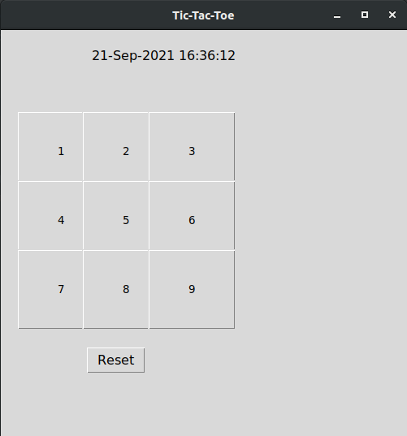
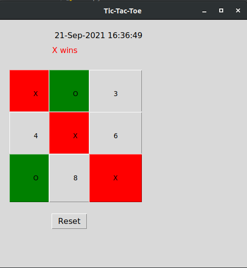

# Optimus-A-Personal-Jarvis

<p align="center">

</p>

This repository offers Python implementation code for a JARVIS system that supports voice based commands.
It also includes Tic-Tac-Toe and voice controlled games, playing music, web searching and many more.


## Table of Contents
* [System Requirements](#system-requirements)
* [Installation and Setup](#installation-and-setup)
* [Usage](#usage)
* [Output](#output)


## System Requirements
* Windows, Linux or Mac OS
* Python 3.6 or above

## Installation and Setup
* Install dependencies using [requirements.txt](requirements.txt)
```
    pip install -r requirements.txt
```

## Usage
* Run [main.py](main.py) as follows:
```
    python3 main.py
```
* Next comes the authentication step where you will have to speak ```"hello optimus"``` on prompted to do so.
* That's all. Your JARVIS is ready to serve you. Njoy!!!!

## Output
Here are some output snapshots of the Tic-Tac-Toe game:





